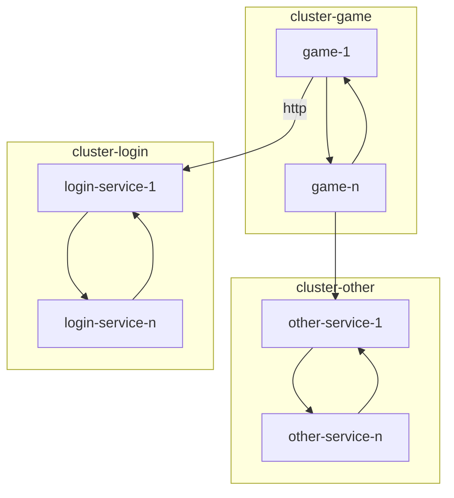
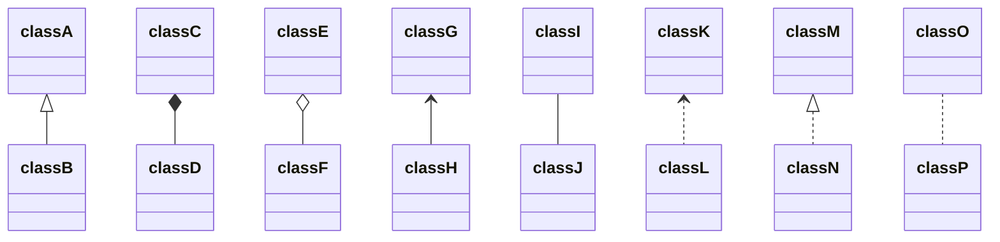
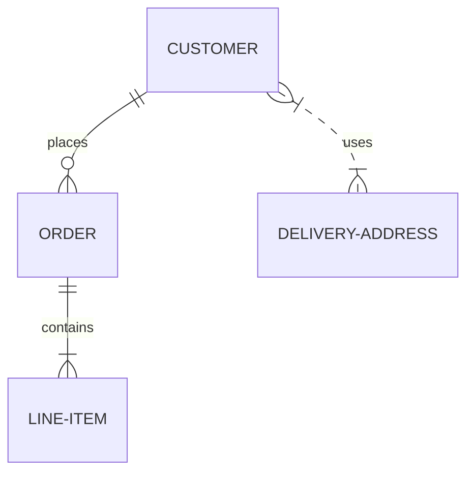

# 架构示意

集群结构示意
相同类型的
com.code.broker.cluster.type=game
com.code.broker.cluster.center=uk

```mermaid
graph TB
    game-1-->|http|login-service-1
	game-n-->other-service-1
	

	game-1-->game-n
	game-n-->game-1
		
	other-service-1-->other-service-n
	other-service-n-->other-service-1	
	
	login-service-1-->login-service-n
	login-service-n-->login-service-1	
	
    subgraph cluster-other
		other-service-1
		other-service-n
    end
    subgraph cluster-login
		login-service-1
		login-service-n
    end
    subgraph cluster-game
		game-1
		game-n
    end
```

```mermaid
graph TD;
    A-->B;
    A-->C;
    B-->D;
    C-->D;
```

```mermaid
classDiagram
classA <|-- classB
classC *-- classD
classE o-- classF
classG <-- classH
classI -- classJ
classK <.. classL
classM <|.. classN
classO .. classP
```

```mermaid
erDiagram
    CUSTOMER ||--o{ ORDER : places
    ORDER ||--|{ LINE-ITEM : contains
    CUSTOMER }|..|{ DELIVERY-ADDRESS : uses
```
