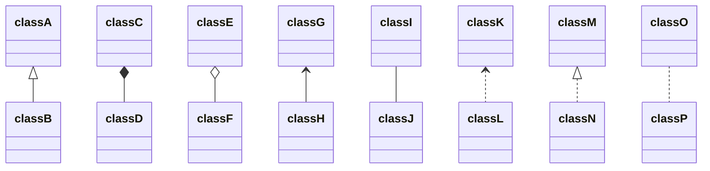
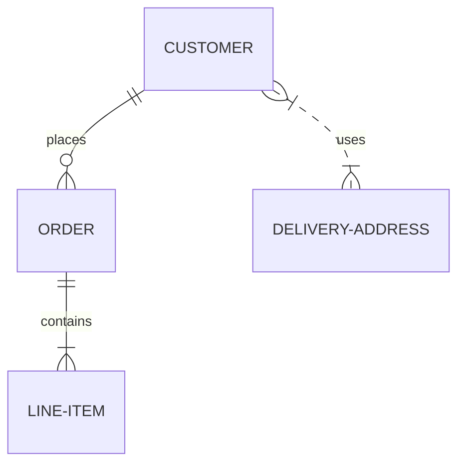

# 架构示意

```集群结构示意

相同类型的

com.code.broker.cluster.type=game
代表业务类型

com.code.broker.cluster.center=uk
代表业务类型所在的数据中心

```


```mermaid
graph TD;
    A-->B;
    A-->C;
    B-->D;
    C-->D;
```


```mermaid
classDiagram
classA <|-- classB
classC *-- classD
classE o-- classF
classG <-- classH
classI -- classJ
classK <.. classL
classM <|.. classN
classO .. classP
```


```mermaid
erDiagram
    CUSTOMER ||--o{ ORDER : places
    ORDER ||--|{ LINE-ITEM : contains
    CUSTOMER }|..|{ DELIVERY-ADDRESS : uses
```
